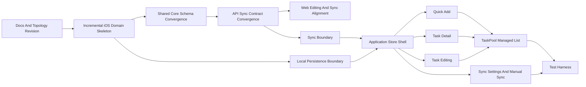

# Norn 移动端结构与功能拓扑

相关文档：

- [architecture.md](architecture.md)
- [product-model.md](product-model.md)
- [scheduling-model.md](scheduling-model.md)
- [../runbooks/ios.md](../runbooks/ios.md)

## 1. 文档目的

这份文档只做四件事：

- 记录 `apps/mobile/ios_ng/Norn/Norn` 当前已经整理到哪一步
- 定义 `apps/mobile/ios_ng/Norn/Norn` 的目录分层
- 定义本轮应存在的类型、文件名和职责
- 定义主要调用关系和数据流
- 定义 feature 拆分、依赖关系和建议提交顺序

这份文档刻意不包含：

- 任何函数实现
- 任何内部成员列表
- 任何具体 JSON schema 细节
- 任何“为了兼容旧实现必须照搬”的约束

它的作用是让后续实现可以被拆成一组可 review 的小提交，并且让文件名、子目录和类型名本身就能表达语义。

本文档同时区分两种状态：

- “当前快照”：仓库里现在已经存在的目录和过渡文件
- “目标结构”：下一步 feature 拆分完成后应达到的语义化结构

## 2. 适用范围

本文档只覆盖 `Norn` 的 iOS_ng 客户端结构规划，重点是任务池维护层，不覆盖：

- Web 端目录重构
- Kairos 调度器的 Swift 侧实现

关于“硬约束 + 价值最大化”的调度问题定义，仍以 [scheduling-model.md](scheduling-model.md) 为真相源。  
Norn 负责维护可用于调度的任务池输入，不在这里重述调度算法。

但本轮 feature 实施同时要求：

- `apps/mobile/ios_ng/Norn/Norn` 的现有目录与文件名只做增量扩展，不做破坏性迁移
- 与任务模型和同步协议直接相关的 `packages/core`、`apps/web`、`services/api` 允许在同一轮中一起收敛

当前阶段的定位是：

- 目录骨架已经按语义重新整理
- `NornApp.swift` 已移入 `App/`
- 资源目录已移入 `Resources/`
- `Domain/App`、`Domain/Task`、`Domain/Sync` 已建立最小领域骨架
- 原有混合模型文件已收缩为 `Domain/Legacy/Models.swift` 过渡占位
- `packages/core` 已收敛到本轮最小 `Task` 模型
- `services/api` 已切到最小 sync contract，对旧数据库列只保留内部兼容
- `apps/web` 已跟随最小模型收敛编辑与 sync 解析
- iOS 本地持久化边界、编码工具和 sync boundary 已落地
- iOS 应用状态壳、用例壳和根视图组装已落地
- Quick Add 本地新增与已配置时的保守同步已接通
- 任务详情页与完成/归档动作已接通
- 编辑器与任务保存流已接通
- 同步设置与手动同步已接通
- 任务池 `list` 模式已接通真实任务数据
- `Norn.xcodeproj` 已补 `NornTests` / `NornUITests` target 和基础覆盖代码
- 本轮未执行任何构建或测试，等待后续手工验收

## 3. 分层约束

### 3.1 分层目标

`Norn` 的 iOS_ng 目录应拆成六个代码语义层，再加一个资源根目录：

- `App`: 应用入口、依赖组装、运行时组合根
- `Domain`: 语义实体、草稿模型、同步设置等稳定概念
- `Application`: 面向 UI 的状态编排与用例
- `Infrastructure`: 本地持久化、远端同步、DTO 映射
- `Utilities`: formatter、codec、JSON 适配等杂项能力
- `UI`: SwiftUI 视图与交互壳
- `Resources`: 资源文件，不承载业务逻辑

### 3.2 允许依赖方向

```text
App
  -> UI
  -> Application
  -> Infrastructure
  -> Domain

UI
  -> Application
  -> Domain

Application
  -> Domain
  -> Infrastructure protocol

Infrastructure
  -> Domain
  -> Utilities

Utilities
  -> Foundation / SwiftUI

Domain
  -> Foundation

Resources
  -> no code dependency
```

### 3.3 禁止事项

- 不得继续把主实现堆回单个巨型 `Models.swift`
- formatter、codec、JSON 辅助不得留在 `Domain`
- UI 不得直接操作文件存储或 HTTP 同步
- `Application` 不得把 DTO 直接暴露给 UI
- 一个文件只放一个主类型；文件名必须和主类型语义一致
- iOS_ng 现有目录和既有文件名不做破坏性迁移；`Domain/Legacy/Models.swift` 文件名必须保留为过渡占位

### 3.4 命名规则

- 文件名优先描述“它是什么”，不是“它怎么实现”
- 协议名必须表明边界，如 `TaskRepositoryProtocol`
- 具体实现名必须表明载体，如 `TaskFileRepository`
- 用例名必须表明动作，如 `QuickAddTaskUseCase`
- UI 文件名沿用界面语义，如 `TaskDetailSheet`

## 4. 目录总图

### 4.1 当前快照

```text
apps/mobile/ios_ng/Norn/Norn/
  App/
    NornApp.swift

  Application/
    State/
      NornAppStore.swift
    UseCases/
      LoadTasksUseCase.swift
      QuickAddTaskUseCase.swift
      SaveTaskDraftUseCase.swift
      SaveTaskSequenceUseCase.swift
      UpdateTaskStatusUseCase.swift
      AppendTaskStepUseCase.swift
      CompleteTaskStepUseCase.swift
      ToggleTaskCompletionUseCase.swift
      ArchiveTaskUseCase.swift
      SaveSyncSettingsUseCase.swift
      SyncTasksUseCase.swift

  Domain/
    App/
      AppTab.swift
    Legacy/
      Models.swift
    Task/
      Task.swift
      TaskStatus.swift
      TaskStep.swift
      TaskStepProgress.swift
      TaskScheduleValue.swift
      TaskBundleMetadata.swift
      TaskDraft.swift
      QuickAddDraft.swift
      TaskSequenceDraft.swift
    Sync/
      SyncSettings.swift
      SyncStatus.swift

  Infrastructure/
    Mapping/
      TaskRecord.swift
    Persistence/
      TaskRepositoryProtocol.swift
      TaskFileRepository.swift
      SyncSettingsRepositoryProtocol.swift
      UserDefaultsSyncSettingsRepository.swift
    Sync/
      TaskSyncClientProtocol.swift
      HTTPTaskSyncClient.swift
      TaskSyncRequest.swift
      TaskSyncResponse.swift

  Resources/
    Assets.xcassets/
      AccentColor.colorset/
      AppIcon.appiconset/

  UI/
    Root/
      ContentView.swift
    Settings/
      SyncSettingsSheet.swift
    Shared/
      QuickAddDock.swift
      EdgeFadeDivider.swift
      NornPreviewFixtures.swift
      TaskBundleBadge.swift
    Sequence/
      SequenceTab.swift
      Components/
        FocusCard.swift
        TaskCard.swift
        TaskStepPreview.swift
    TaskPool/
      TaskDependencyPickerSheet.swift
      TaskEditorSheet.swift
      TaskDetailSheet.swift
      TaskSequenceEditorSheet.swift
      TaskPoolTab.swift
    Schedule/
      ScheduleTab.swift

  Utilities/
    Coding/
      ISO8601DateCodec.swift
      JSONValue.swift
    Formatting/
      RelativeDueDateFormatter.swift
      TaskDisplayFormatter.swift
```

当前快照说明：

- `Application/State` 已落 `NornAppStore`，作为当前唯一 UI 状态入口
- `Application/UseCases` 已落读取、快速新增、保存草稿、任务序列批量保存、主序列重排、显式任务状态切换、详情内追加子任务、串行子任务推进、完成/归档、同步设置和同步用例
- `Infrastructure/Persistence`、`Infrastructure/Mapping` 已落本地任务仓库、设置仓库和记录映射
- `Infrastructure/Sync` 已落 HTTP client、sync request 和 sync response DTO
- `Utilities/Formatting` 已接住从 Legacy 迁出的展示辅助能力
- `Utilities/Coding` 已提供日期和 JSON 编解码基础能力
- `Domain/App`、`Domain/Task`、`Domain/Sync` 已接管当前 UI 使用的主语义类型
- `Domain/Legacy/Models.swift` 已缩成占位壳，只保留过渡文件名
- `App/NornApp.swift` 已承担 live 依赖组装，`UI/Root/ContentView.swift` 已承担共享背景、全屏 edge-to-edge 分页裁剪壳、root scoped Sequence dock safeAreaInset 和 sheet 挂载点
- `QuickAddDock` 已通过 store 和 use case 形成本地创建闭环，并在激活态同时提供“详情”和“序列”入口：前者把 Quick Add 草稿提升到详细新建 sheet，后者进入任务序列批量录入 sheet
- `TaskSequenceDraft`、`TaskBundleMetadata` 与 `SaveTaskSequenceUseCase` 已接住“连续录入多条任务并共享 bundle 标识”的能力；任务仍以多条 `Task` 落库，只通过共享元数据和顺序位维持成组展示
- `ContentView` 现由 page shell 负责全屏裁剪范围，各 tab wrapper 通过方向感知的 `safeAreaPadding` 恢复内容对圆角、灵动岛和触控条的避让：竖屏主避让 top/bottom；横屏细化仍属后续低优先级收敛项，当前只保留不破坏竖屏和 dock 编排的保守实现；当前横向分页顺序为 `Sequence -> Task Pool -> Schedule`
- `Sequence` 已收敛为“当前聚焦 + 主序列 + 接下来摘要”，主序列改为长按卡片右上角把手直接拖拽重排并通过现有 sync 同步顺序
- `Sequence` 主序列标题已恢复，卡片层级改为细长主卡并直接点击打开 `TaskDetailSheet`
- `Sequence` 时间线标记已进一步收敛为更接近手绘参考的纯色圆点 + 分段点划轨：节点与上下虚线段留出间隔，末端继续保留渐隐渐细的射线尾迹
- `Sequence` 底部输入 dock 重新由 root scoped `safeAreaInset` 编排，并继续通过固定 `reservedDockHeight` 驱动内容 safe-area 让位，避免横向切 tab 或滚动期间出现滚动偏移跳变与实时测量带来的重复重布局
- `Sequence` 顶部状态栏区域与底部 dock 区域已补齐更柔和的原生风格渐变 safe-area chrome：顶部渐变抬高并减轻不透明度，底部渐变改为挂在 dock 背后做过渡；dock 本体也进一步放大高度、把圆角收敛到更接近屏幕圆角同心的几何，并在外缘补上一圈更轻量的静态柔边外环
- `Sequence` 的滚动裁剪范围重新由 root page shell 的全屏 edge-to-edge 延伸承担，不与 dock 的 safe-area 语义混用
- `Sequence` 在竖屏主要只补 top safe-area，bottom 继续由 dock reserve 承担；横屏安全区、岛区、圆角和左右对称的进一步细化暂记为低优先级遗留 feature
- `Sequence` 主序列拖拽已收回到卡片右上角把手，普通滚动期不再常驻挂整卡 drop 命中层；时间线装饰留在原位，卡片呼吸感通过行内留白放松，并为拖拽预览补齐圆角形状语义，活体卡片本身不再进入额外灰化态
- `TaskSequenceEditorSheet` 已支持连续输入多条任务描述、设置可选序列标签并一次保存；现阶段 bundle 仅作为卡片标识与顺序保持语义，不在 `Sequence` 中折叠成组卡
- `TaskDetailSheet` 已改为真正的半模态轻编辑面板：toolbar 仍保留完整编辑入口，但外层已支持直接切到进行中、直接追加子任务、点击当前步骤推进串行进度，以及完成/归档操作
- `TaskEditorSheet` 已通过 `TaskDraft` 和 `SaveTaskDraftUseCase` 形成编辑保存闭环，并把任务依赖改为二层 searchable picker，避免在主表单里平铺全量依赖 toggle
- `TaskStepPreview` 已成为 Sequence / Focus / TaskPool 卡片共用的串行子任务预览组件，统一在卡片上展示当前步骤和步进位置
- `TaskStepProgress`、`TaskRecord` 和 `TaskSyncRequest` 已把步骤 `startedAt/completedAt` 进度接入本地持久化与同步载荷；已完成步骤不再进入共享调度输入
- `TaskPool` header 已接入同步状态、手动刷新和 `SyncSettingsSheet`
- `TaskPool` 的 `list` 模式已直接绑定 store 中的可见任务序列
- `apps/mobile/ios_ng/Norn/NornTests` 与 `apps/mobile/ios_ng/Norn/NornUITests` 已落基础数据流和 smoke 测试代码
- `UI/` 已经按页面和共享组件分层
- `Resources/Assets.xcassets` 已从工程根平移到资源目录

### 4.2 目标结构

```text
apps/mobile/ios_ng/Norn/Norn/
  App/
    NornApp.swift

  Domain/
    App/
      AppTab.swift
    Legacy/
      Models.swift
    Task/
      Task.swift
      TaskStatus.swift
      TaskStep.swift
      TaskStepProgress.swift
      TaskScheduleValue.swift
      TaskBundleMetadata.swift
      TaskDraft.swift
      QuickAddDraft.swift
      TaskSequenceDraft.swift
    Sync/
      SyncSettings.swift
      SyncStatus.swift

  Application/
    State/
      NornAppStore.swift
    UseCases/
      LoadTasksUseCase.swift
      QuickAddTaskUseCase.swift
      SaveTaskDraftUseCase.swift
      SaveTaskSequenceUseCase.swift
      UpdateTaskStatusUseCase.swift
      AppendTaskStepUseCase.swift
      CompleteTaskStepUseCase.swift
      ToggleTaskCompletionUseCase.swift
      ArchiveTaskUseCase.swift
      SaveSyncSettingsUseCase.swift
      SyncTasksUseCase.swift

  Infrastructure/
    Persistence/
      TaskRepositoryProtocol.swift
      TaskFileRepository.swift
      SyncSettingsRepositoryProtocol.swift
      UserDefaultsSyncSettingsRepository.swift
    Sync/
      TaskSyncClientProtocol.swift
      HTTPTaskSyncClient.swift
      TaskSyncRequest.swift
      TaskSyncResponse.swift
    Mapping/
      TaskRecord.swift

  Utilities/
    Coding/
      ISO8601DateCodec.swift
      JSONValue.swift
    Formatting/
      RelativeDueDateFormatter.swift
      TaskDisplayFormatter.swift

  UI/
    Root/
      ContentView.swift
    Shared/
      QuickAddDock.swift
      EdgeFadeDivider.swift
      TaskBundleBadge.swift
    Sequence/
      SequenceTab.swift
      Components/
        FocusCard.swift
        TaskCard.swift
        TaskStepPreview.swift
    TaskPool/
      TaskPoolTab.swift
      TaskDependencyPickerSheet.swift
      TaskDetailSheet.swift
      TaskEditorSheet.swift
      TaskSequenceEditorSheet.swift
    Settings/
      SyncSettingsSheet.swift
    Schedule/
      ScheduleTab.swift

  Resources/
    Assets.xcassets/
```

### 4.3 本轮共享契约

本轮会同时收敛 iOS、Web、API 共用的最小任务模型和同步载荷。目标契约如下：

| 类型 | 字段 |
| --- | --- |
| `Task` | `id` `title` `rawInput` `description?` `status` `estimatedMinutes` `minChunkMinutes` `dueAt?` `tags` `scheduleValue` `dependsOnTaskIds` `steps` `concurrencyMode` `createdAt` `updatedAt` `extJson` |
| `TaskScheduleValue` | `rewardOnTime` `penaltyMissed` |
| `TaskStepTemplate` | `id` `title` `estimatedMinutes` `minChunkMinutes` `dependsOnStepIds` `progress?{startedAt?,completedAt?}` |
| `TaskSyncRequest` | `deviceId` `tasks` |
| `TaskSyncResponse` | `deviceId?` `synced?` `items` |

本轮明确退出共享主契约的字段：

- `importance`
- `value`
- `difficulty`
- `postponability`
- `taskTraits`

## 5. 类型定义图

以下内容是“目标结构”的类型图，不代表这些文件现在已经全部存在。当前真实状态以上一节“当前快照”为准。

### 5.1 Domain

| 文件 | 主类型 | 作用 | 备注 |
| --- | --- | --- | --- |
| `Domain/App/AppTab.swift` | `AppTab` | 定义页面级导航枚举 | 只表达 tab 语义 |
| `Domain/Task/Task.swift` | `Task` | 任务聚合根 | Norn 维护的主实体 |
| `Domain/Task/TaskStatus.swift` | `TaskStatus` | 任务生命周期状态 | 只定义状态语义，不负责 UI 色彩 |
| `Domain/Task/TaskStep.swift` | `TaskStep` | 任务内步骤单元 | 当前默认串行推进 |
| `Domain/Task/TaskStepProgress.swift` | `TaskStepProgress` | 步骤级 started/completed 进度 | 供 UI、持久化和同步共用 |
| `Domain/Task/TaskScheduleValue.swift` | `TaskScheduleValue` | 任务价值输入 | 与调度价值语义对齐 |
| `Domain/Task/TaskDraft.swift` | `TaskDraft` | 详细编辑使用的草稿模型 | 服务于 editor，不直接落盘 |
| `Domain/Task/QuickAddDraft.swift` | `QuickAddDraft` | Quick Add 解析后的最小草稿 | 服务于快速新增入口 |
| `Domain/Task/TaskOrdering.swift` | `TaskOrdering` | 任务排序与主序列顺序元数据 | 负责 `extJSON.norn.sequenceRank` 读写与排序比较 |
| `Domain/Sync/SyncSettings.swift` | `SyncSettings` | 同步配置语义模型 | 只表达 URL、token 等配置概念 |
| `Domain/Sync/SyncStatus.swift` | `SyncStatus` | 同步状态模型 | 表达未配置、空闲、同步中、失败等状态 |

### 5.2 Application

| 文件 | 主类型 | 作用 | 对外入口 |
| --- | --- | --- | --- |
| `Application/State/NornAppStore.swift` | `NornAppStore` | UI 总状态入口 | `bootstrap()` `submitQuickAdd()` `openNewTaskDraftFromQuickAdd()` `openTaskDetail()` `openTaskEditor()` `updateTaskStatus()` `appendTaskStep()` `completeTaskStep()` `openSyncSettings()` `refresh()` |
| `Application/UseCases/LoadTasksUseCase.swift` | `LoadTasksUseCase` | 读取当前任务集合 | `execute()` |
| `Application/UseCases/QuickAddTaskUseCase.swift` | `QuickAddTaskUseCase` | 处理底部快速新增 | `execute(rawInput:)` |
| `Application/UseCases/SaveTaskDraftUseCase.swift` | `SaveTaskDraftUseCase` | 创建或保存详细任务 | `execute(draft:)` |
| `Application/UseCases/UpdateTaskStatusUseCase.swift` | `UpdateTaskStatusUseCase` | 显式切换任务状态 | `execute(taskID:status:)` |
| `Application/UseCases/AppendTaskStepUseCase.swift` | `AppendTaskStepUseCase` | 在详情半模态里快速追加串行子任务 | `execute(taskID:title:)` |
| `Application/UseCases/CompleteTaskStepUseCase.swift` | `CompleteTaskStepUseCase` | 推进当前串行子任务 | `execute(taskID:stepID:)` |
| `Application/UseCases/ReorderSequenceTasksUseCase.swift` | `ReorderSequenceTasksUseCase` | 主序列拖拽后的顺序持久化 | `execute(primaryTaskIDs:)` |
| `Application/UseCases/ToggleTaskCompletionUseCase.swift` | `ToggleTaskCompletionUseCase` | 切换完成/恢复待办 | `execute(taskID:)` |
| `Application/UseCases/ArchiveTaskUseCase.swift` | `ArchiveTaskUseCase` | 归档任务 | `execute(taskID:)` |
| `Application/UseCases/SaveSyncSettingsUseCase.swift` | `SaveSyncSettingsUseCase` | 保存同步设置 | `execute(settings:)` |
| `Application/UseCases/SyncTasksUseCase.swift` | `SyncTasksUseCase` | 手动同步与变更后保守同步 | `execute(settings:)` |

### 5.3 Infrastructure

| 文件 | 主类型 | 作用 | 对外入口 |
| --- | --- | --- | --- |
| `Infrastructure/Persistence/TaskRepositoryProtocol.swift` | `TaskRepositoryProtocol` | 任务持久化边界 | `loadAll()` `save()` `upsert()` `archive()` `toggleCompletion()` |
| `Infrastructure/Persistence/TaskFileRepository.swift` | `TaskFileRepository` | JSON 文件本地任务仓库 | 实现 `TaskRepositoryProtocol` |
| `Infrastructure/Persistence/SyncSettingsRepositoryProtocol.swift` | `SyncSettingsRepositoryProtocol` | 同步配置持久化边界 | `load()` `save()` |
| `Infrastructure/Persistence/UserDefaultsSyncSettingsRepository.swift` | `UserDefaultsSyncSettingsRepository` | `UserDefaults` 配置存储实现 | 实现 `SyncSettingsRepositoryProtocol` |
| `Infrastructure/Sync/TaskSyncClientProtocol.swift` | `TaskSyncClientProtocol` | 远端同步边界 | `sync(tasks:settings:)` |
| `Infrastructure/Sync/HTTPTaskSyncClient.swift` | `HTTPTaskSyncClient` | HTTP 同步实现 | 实现 `TaskSyncClientProtocol` |
| `Infrastructure/Sync/TaskSyncRequest.swift` | `TaskSyncRequest` | 同步请求 DTO | 同步 `TaskStepProgress` |
| `Infrastructure/Sync/TaskSyncResponse.swift` | `TaskSyncResponse` | 同步响应 DTO | 只服务远端协议 |
| `Infrastructure/Mapping/TaskRecord.swift` | `TaskRecord` | 本地存储记录模型 | 负责 `Domain <-> Persistence` 映射，并落 `TaskStepProgress` |

### 5.4 Utilities

| 文件 | 主类型 | 作用 | 备注 |
| --- | --- | --- | --- |
| `Utilities/Coding/ISO8601DateCodec.swift` | `ISO8601DateCodec` | 日期编解码工具 | UI 无需直接依赖 |
| `Utilities/Coding/JSONValue.swift` | `JSONValue` | 半结构化 JSON 辅助类型 | 仅供基础设施层或过渡映射使用 |
| `Utilities/Formatting/RelativeDueDateFormatter.swift` | `RelativeDueDateFormatter` | 截止日期相对文案格式化 | UI 展示辅助 |
| `Utilities/Formatting/TaskDisplayFormatter.swift` | `TaskDisplayFormatter` | 任务展示文案拼装 | UI 展示辅助 |

### 5.5 UI

| 文件 | 主类型 | 作用 | 备注 |
| --- | --- | --- | --- |
| `UI/Root/ContentView.swift` | `ContentView` | 根容器、共享背景与 sheet 挂载点 | 不直连持久化和 HTTP |
| `UI/Shared/QuickAddDock.swift` | `QuickAddDock` | 底部快速输入 | 激活态提供“详情 / 序列”入口 |
| `UI/Shared/EdgeFadeDivider.swift` | `EdgeFadeDivider` | 顶部分隔线组件 | 纯视觉组件 |
| `UI/Shared/TaskBundleBadge.swift` | `TaskBundleBadge` | 任务 bundle 标识 | 共用于 Focus / Sequence / TaskPool 卡片 |
| `UI/Sequence/SequenceTab.swift` | `SequenceTab` | 当前序列页 | 当前聚焦 + 主序列 + 接下来摘要，主序列通过长按右上角把手重排，落位时单次更新顺序 |
| `UI/Sequence/Components/FocusCard.swift` | `FocusCard` | 进行中任务聚焦卡 | 纯卡片组件 |
| `UI/Sequence/Components/TaskCard.swift` | `TaskCard` | 通用任务卡片 | 当前主要复用于 `TaskPool` 的 list 模式 |
| `UI/Sequence/Components/TaskStepPreview.swift` | `TaskStepPreview` | 串行子任务当前步骤预览 | 共用于 Focus / Sequence / TaskPool 卡片 |
| `UI/TaskPool/TaskPoolTab.swift` | `TaskPoolTab` | 任务池管理页 | 当前位于第二个顶层分页入口，本轮只做 `list` 模式 |
| `UI/TaskPool/TaskDependencyPickerSheet.swift` | `TaskDependencyPickerSheet` | 任务依赖二层选择器 | searchable + filter + multi-select |
| `UI/TaskPool/TaskDetailSheet.swift` | `TaskDetailSheet` | 任务详情半模态 | 外层可切进行中、追加子任务、推进当前步骤、完成/归档 |
| `UI/TaskPool/TaskEditorSheet.swift` | `TaskEditorSheet` | 新建与编辑任务表单 | 基于 `TaskDraft`，依赖选择器改为二层 picker |
| `UI/TaskPool/TaskSequenceEditorSheet.swift` | `TaskSequenceEditorSheet` | 任务序列批量录入表单 | 支持连续输入多条任务并一次保存 |
| `UI/Settings/SyncSettingsSheet.swift` | `SyncSettingsSheet` | 同步配置页 | 基于 `SyncSettings` |
| `UI/Schedule/ScheduleTab.swift` | `ScheduleTab` | 调度页外壳 | 当前位于第三个顶层分页入口，本轮不扩展调度实现 |

## 6. 调用关系与数据流

### 6.1 Quick Add

```text
QuickAddDock
  -> NornAppStore.submitQuickAdd
    OR
  -> NornAppStore.openNewTaskDraftFromQuickAdd()
    OR
  -> NornAppStore.openNewTaskSequenceDraftFromQuickAdd()
  -> QuickAddTaskUseCase.execute(rawInput:)
    OR
  -> QuickAddDraft.parse(rawInput:) -> TaskEditorSheet
    OR
  -> TaskSequenceEditorSheet
  -> SaveTaskSequenceUseCase.execute(draft:)
  -> TaskRepositoryProtocol.save/upsert
  -> LoadTasksUseCase.execute()
  -> NornAppStore refresh visible tasks
  -> SyncTasksUseCase.execute(settings:) [仅在已配置时]
```

### 6.2 任务详情与编辑

```text
SequenceTab / FocusCard / TaskPool list item
  -> NornAppStore.openTaskDetail(taskID:)
  -> TaskDetailSheet
  -> NornAppStore.updateTaskStatus(taskID:status:)
  -> NornAppStore.appendTaskStep(taskID:title:)
  -> NornAppStore.completeTaskStep(taskID:stepID:)
  -> NornAppStore.openTaskEditor(taskID:)
  -> TaskEditorSheet
  -> SaveTaskDraftUseCase.execute(draft:)
  -> UpdateTaskStatusUseCase / AppendTaskStepUseCase / CompleteTaskStepUseCase
  -> TaskRepositoryProtocol.save()
  -> LoadTasksUseCase.execute()
  -> SyncTasksUseCase.execute(settings:) [保守触发]
```

### 6.3 主序列重排

```text
SequenceTab main sequence handle drag
  -> NornAppStore.reorderPrimarySequence(taskIDs:)
  -> ReorderSequenceTasksUseCase.execute(primaryTaskIDs:)
  -> TaskOrdering.applyingSequenceRank(...)
  -> TaskRepositoryProtocol.save()
  -> LoadTasksUseCase.execute()
  -> SyncTasksUseCase.execute(settings:) [保守触发]
```

### 6.4 完成、推进与归档

```text
TaskDetailSheet completion/progress/archive action
  -> ToggleTaskCompletionUseCase.execute(taskID:)
  -> UpdateTaskStatusUseCase.execute(taskID:status:)
  -> AppendTaskStepUseCase.execute(taskID:title:)
  -> CompleteTaskStepUseCase.execute(taskID:stepID:)
  -> ArchiveTaskUseCase.execute(taskID:)
  -> TaskRepositoryProtocol.toggleCompletion/archive
  -> LoadTasksUseCase.execute()
  -> SyncTasksUseCase.execute(settings:) [保守触发]
```

### 6.5 同步设置与手动同步

```text
SyncSettingsSheet
  -> SaveSyncSettingsUseCase.execute(settings:)
  -> SyncSettingsRepositoryProtocol.save()

TaskPoolTab / SyncSettingsSheet
  -> SyncTasksUseCase.execute(settings:)
  -> LoadTasksUseCase.execute() for local snapshot
  -> TaskSyncClientProtocol.sync(tasks:settings:)
  -> TaskRepositoryProtocol.upsert()
  -> NornAppStore refresh visible tasks and sync status
```

## 7. Feature 拓扑图



## 8. 单步提交计划

| 节点 | 目标 | 主要文件范围 | 建议 commit message |
| --- | --- | --- | --- |
| `F0` | 修订实施拓扑，明确 iOS 增量开发与共享 schema 收敛 | `docs/specs/norn-mobile-structure.md` `docs/README.md` | `docs(norn): revise mobile topology for incremental ios and schema convergence` |
| `F1` | 增量新增 iOS Task 领域模型骨架，并保留 Legacy 占位文件 | `Domain/App` `Domain/Task` `Domain/Sync` `Domain/Legacy/Models.swift` | `refactor(norn): define task domain skeleton incrementally` |
| `F2` | 收敛 `packages/core` 的共享 Task 模型与调度依赖 | `packages/core` | `refactor(core): converge task model to norn schema` |
| `F3` | 收敛 API sync contract 和任务 DTO 暴露形状 | `services/api` `docs/specs/architecture.md` `docs/runbooks/client-sync.md` | `refactor(api): align task sync contract to norn schema` |
| `F4` | 让 Web 编辑器、sync parser 和 controller 跟随新模型 | `apps/web` | `refactor(web): align task editing and sync parsing to norn schema` |
| `F5` | 拆出本地持久化边界与 JSON 文件仓库 | `Infrastructure/Persistence` `Infrastructure/Mapping` `Utilities/Coding` | `refactor(norn): define local persistence boundary` |
| `F6` | 拆出同步边界与 HTTP client | `Infrastructure/Sync` | `refactor(norn): define sync boundary` |
| `F7` | 建立 `NornAppStore` 和用例壳 | `Application/State` `Application/UseCases` `App/NornApp.swift` `UI/Root/ContentView.swift` | `refactor(norn): add application state shell` |
| `F8` | 接通 Quick Add 本地新增 | `UI/Root` `UI/Shared` `Application/UseCases/QuickAddTaskUseCase.swift` | `feat(norn): add quick add task creation flow` |
| `F9` | 接通详情查看与状态动作 | `UI/Sequence` `UI/TaskPool/TaskDetailSheet.swift` | `feat(norn): add task detail flow` |
| `F10` | 接通任务编辑器和保存 | `UI/TaskPool/TaskEditorSheet.swift` `Domain/Task/TaskDraft.swift` | `feat(norn): add task editing flow` |
| `F11` | 接通同步设置与手动同步 | `UI/Settings` `Application/UseCases/SyncTasksUseCase.swift` `docs/runbooks/ios.md` | `feat(norn): add sync settings and manual sync` |
| `F12` | 让 TaskPool 的 `list` 模式接入真实数据 | `UI/TaskPool/TaskPoolTab.swift` | `feat(norn): connect task pool list to app state` |
| `F13` | 加上数据流和 UI smoke tests | `NornTests` `NornUITests` | `test(norn): add data flow and smoke coverage` |

## 9. 每步 review 的关注点

### 9.1 `F1`、`F5` 到 `F7`

只 review 结构，不 review 业务功能：

- 文件名是否一眼可懂
- 目录层级是否表达父子关系
- 类型职责是否重复
- 是否再次出现巨型模型文件

### 9.2 `F2` 到 `F4`

只 review 共享模型与协议收敛是否一致：

- 新旧字段是否存在双轨暴露
- Web、API、core 是否共享同一主契约
- 解析逻辑是否只保留一份真相源

### 9.3 `F8` 到 `F12`

只 review 单个 feature 是否闭环：

- 入口 UI 是否单一
- 状态来源是否单一
- 数据流是否只沿既定方向移动
- 是否引入跨层直接调用

### 9.4 `F13`

只 review 覆盖面是否对齐 feature：

- repository 是否有独立测试
- sync client 是否可 stub
- app store 是否可注入依赖
- UI smoke 是否只覆盖闭环主路径

## 10. 当前约束与保留意见

- 当前实际仓库仍存在 `Domain/Legacy/Models.swift` 这个过渡文件；本轮要求保留该文件名，只允许收缩为过渡占位。
- `Resources/Assets.xcassets` 已经是当前标准落点；后续不要把资源重新混回代码根目录。
- `App/NornApp.swift` 已经是当前标准落点；后续不要把入口文件重新塞回 `Application/` 或 `UI/`。
- `apps/mobile/ios_ng/Norn/Norn` 的现有目录和文件名只做增量扩展，不做删除、回退或迁移。
- 本轮允许 `packages/core`、`apps/web`、`services/api` 对共享任务模型和 sync contract 做破坏性收敛，只要最终主契约保持单一。
- 若后续发现 `TaskDraft` 或 `SyncStatus` 需要进一步拆分，应优先新增语义化文件，而不是回退到巨型共享模型。
- 如果未来 Kairos 的 Swift 侧实现单独恢复，应另开文档定义其目录与类型，而不是继续堆进这份 Norn 文档。
- 横屏场景下的安全区细化仍未收敛：当前先保证不破坏竖屏质量、dock 下沉编排和滚动裁剪延伸；后续应把“岛区/圆角避让、header 不被裁切、左右占位对称”作为一个低优先级独立 feature 再处理。
- 任务序列当前只共享 bundle 标识并保持单卡展示；如果未来需要在 `Sequence` 中折叠成组卡或组块，应作为独立 feature 设计，避免和现有主序列重排语义混用。
